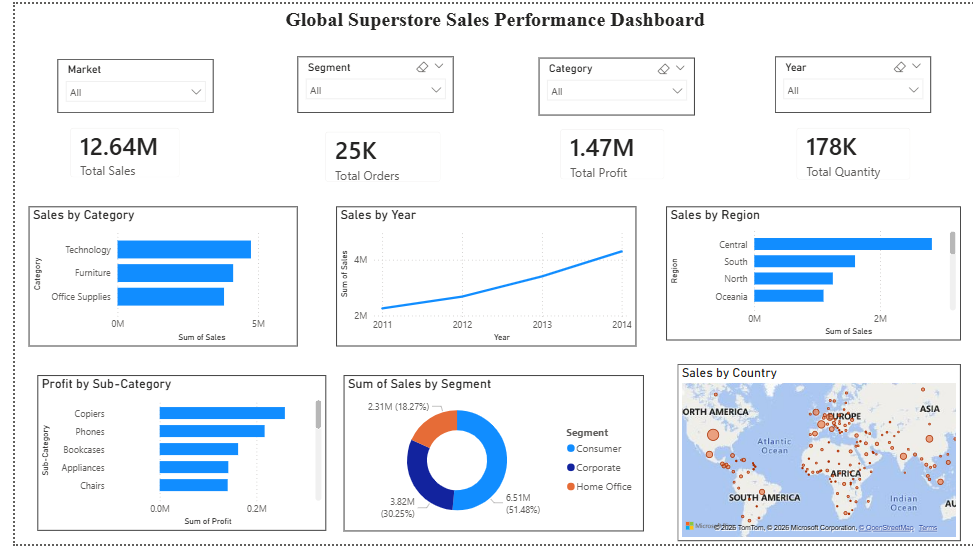

# Global Superstore Sales Performance Dashboard

This project presents an interactive sales analysis dashboard built using Power BI.  
The dashboard analyzes the Global Superstore dataset to understand sales trends, product performance, and regional distribution.

## Tools Used
- Power BI
- Microsoft Excel
- Data Visualization

## Dashboard Insights
The dashboard provides insights such as:
- Total Sales, Total Orders, Total Profit, and Total Quantity
- Sales by Category
- Sales Trend by Year
- Sales by Region
- Profit by Sub-Category
- Sales by Customer Segment
- Sales Distribution by Country (Map Visualization)

## Dashboard Preview

## Files Included
- `Global_Superstore.pbix` – Power BI dashboard file  
- `Global_Superstore.xlsx` – Dataset used  
- `Dashboard.png` – Dashboard screenshot  
- `Presentation.pdf` – Project presentation  

